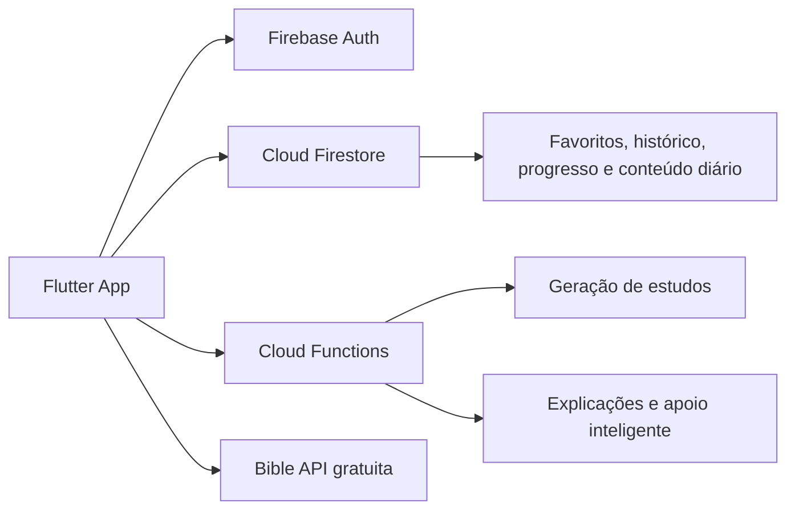
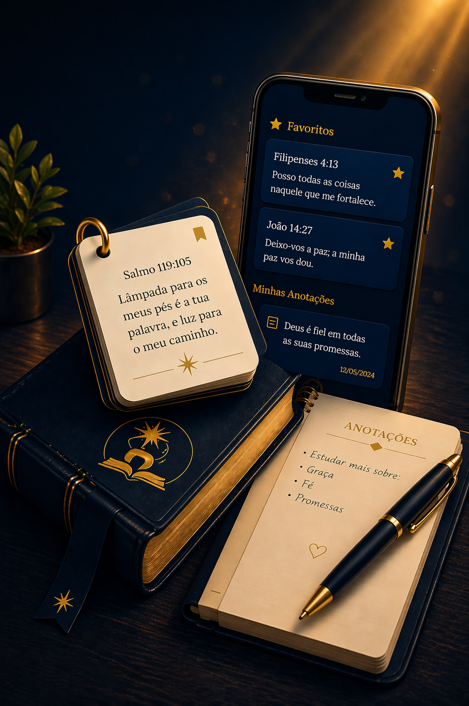
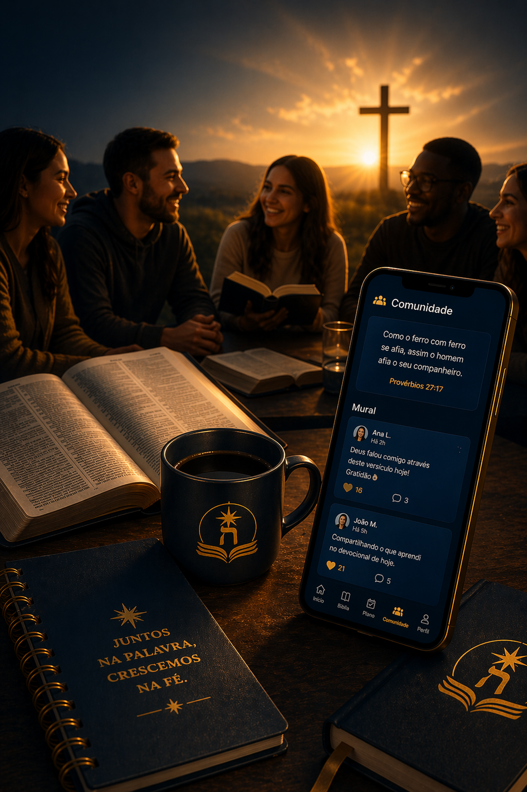

  

<h1 align="center">App Bíblia Parnassá</h1>

  Um companheiro espiritual em Flutter para leitura bíblica, estudos diários, revisão de versículos, oração, jejum e jornada cristã guiada por conteúdo renovado todos os dias.

  
  
  
  

## Visão

O **App Bíblia Parnassá** foi concebido para unir devoção, constância e profundidade bíblica em uma experiência mobile elegante e acolhedora. Em vez de ser apenas um leitor de versículos, o projeto funciona como uma jornada espiritual completa: leitura contínua da Bíblia, estudos temáticos, quizzes renovados diariamente, flashcards para memorização, registro de oração, diário de jejum e trilhas de crescimento cristão.

A proposta do produto é simples: ajudar o usuário a **permanecer na Palavra todos os dias**, com menos fricção e mais clareza.

## O que o app entrega

- **Estudo diário renovado** com tema, reflexão, aplicação prática e perguntas de revisão.
- **Quiz bíblico do dia** conectado ao estudo atual, com renovação diária e pontuação gamificada.
- **Leitor contínuo da Bíblia** por livro e capítulo, com favoritos, histórico e explicações contextuais.
- **Flashcards bíblicos** para memorizar versículos importantes e revisar o que ficou pendente.
- **Diário espiritual** com pedidos de oração, acompanhamento de jejum e registro da caminhada.
- **Vídeos cristãos** reunindo conteúdos de canais relevantes para discipulado e estudo.
- **Experiência visual editorial** inspirada em tons de azul e dourado, refletindo reverência, nobreza e contemplação.

## Experiência do produto

O app foi desenhado para parecer menos uma ferramenta fria e mais um espaço de recolhimento e constância. Cada tela busca reforçar três ideias centrais:

- **Clareza**: conteúdos objetivos, legíveis e espiritualmente úteis.
- **Ritmo diário**: estudos, perguntas e revisões que mudam com o tempo.
- **Profundidade acessível**: recursos bíblicos mais ricos sem sobrecarregar o usuário leigo.

## Arquitetura em alto nível

## Galeria visual

Abaixo estão algumas das **telas de onboarding atualmente integradas ao app**, refletindo a linguagem visual e a atmosfera da experiência.

  
  
  
  
  

## Módulos principais

- **Autenticação e onboarding**
- **Dashboard devocional**
- **Leitor bíblico com histórico e favoritos**
- **Estudo guiado e explicações contextuais**
- **Quiz bíblico diário**
- **Cards de memorização e revisão**
- **Diário espiritual: oração e jejum**
- **Vídeos cristãos selecionados**
- **Perfil, progresso e gamificação**

## Direção do projeto

O Bíblia Parnassá está sendo desenvolvido como uma plataforma cristã mobile-first que combina:

- **discipulado diário**,
- **memorização bíblica**,
- **reflexão prática**,
- **conteúdo renovado**,
- **e uma identidade visual reverente e contemporânea**.

Mais do que acompanhar leituras, a ideia é criar um ambiente que ajude o usuário a cultivar constância espiritual com beleza, foco e profundidade.
